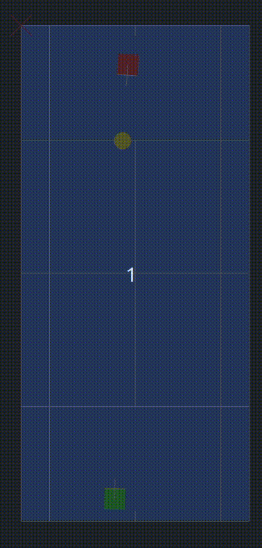

# Machine Learning Tennis Simulation
Virtualized graphical simulation of a classic tennis match with Machine Learning

|               Preview             |  Description |
:-------------------------:|:-------------------------:
  |  As soon as the program begins, the tennis players will automatically begin outputting simulation data in a text file in /bin called DATA.txt that will contain coordinates for the x,y,and z velocity components of the player's hit and the corresponding position of the ball when it first lands. This will be the basis for the dataset used in my Convolutional Neural Network project and will allow these players to learn over time and improve their shot accuracy for the longer they play. Thus a higher update speed is ideal.  |

# **Requires** 
    OpenFrameworks v0.10.1 (openframeworks.cc/download/) to be placed in one's home directory for Linux/MacOS (Working on Windows Support with Visual studios/CinderC++)
# **Compile** 
    Once you install OpenFrameworks for you system, place it in your *home ~/* directory, then in the project folder run *make* to compile it
# **Controls** 
    Up/Down arrows control the relative speeds of the update in the simulation
    These increment by 10x so it is easy to overburden the computer. Be Careful!
